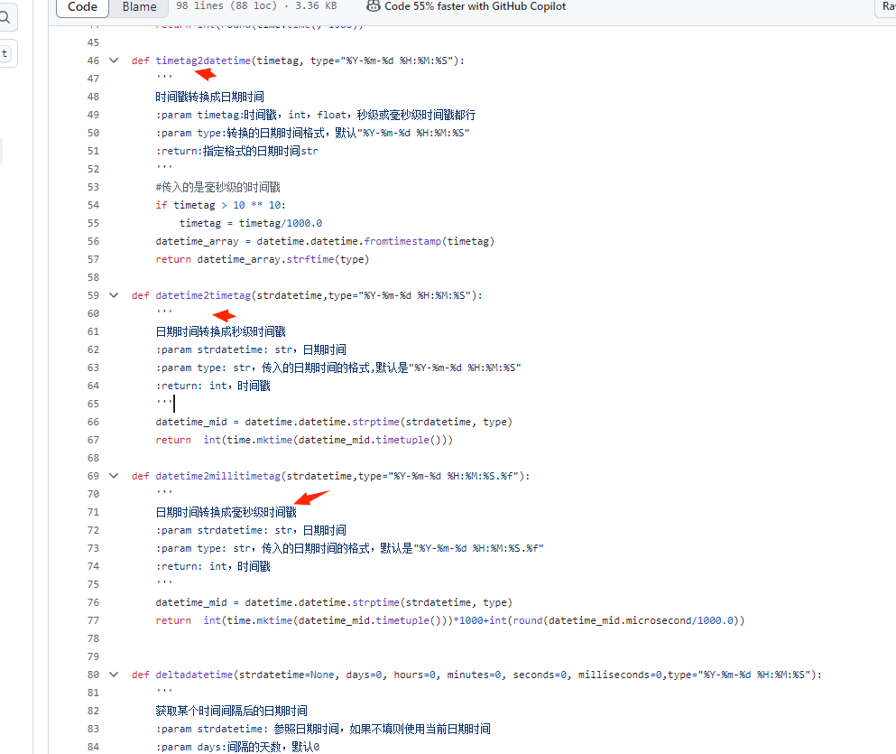

# 1 NbTime 介绍

## 1.0 安装 

pip install nb_time

## 1.1 NbTime 为什么好?

`nb_time` 是面向对象,入参兼容类型能力最强,万能时间字符串识别,时区支持优雅,无限链式调用,性能最好的时间处理工具包(性能超 `arrow` 三方包 700%).

`NbTime`类始终是时间操作的唯一入口,不像其他三方包或者用户自己封装的公用`utils/time_utils.py` 需要记忆选择几十种时间转换函数,`NbTime(x)`是一招鲜吃遍天.

`nb_time` 要做的是用户 `utils/time_utils.py` 的“终结者”.

为什么要写处理时间的包
```
开发中，关于处理时间转换虽然是一件不值一提很微不足道很小的事情，但也是一个常见的事情。
封装的不好的时间操作工具库，造成每次调用麻烦，和性能问题.
例如要调用不同的函数来处理 时间戳 时间字符串 时间对象之间的转换，
以及烦人的时区的转化，从一个时间种类变化到另一个时间类型形态，用户在中间过程要调用三四次不同的函数来转化，
才能处理得到想要的最终结果。

NbTime对象实例化入参接受所有种类的入参，不需要用户针对不同的传参类型做时间转化而选择不同的函数
，用户无脑将任意入参传给NbTime即可；NbTime将常用的时间处理转化结果，作为对象的惰性属性。
一个NbTime的实例化入参搞定所有时间转化需求，不需要用户亲自去选择各种用途的时间转换函数来对时间做转换。
```

## 1.2  time_utils.py  为什么很不好用?

例如像下面图片这种 模块级 + 各种各样的函数 封装的 时间工具包，就太不好用了，因为需要记忆和选择各种各样的不同用途的函数对时间进行转化。

封装时间操作不难，但如果封装的不好用，造成项目中调用它处处难。

那种 一个 time_utils.py 下 def 100 多个时间转换函数的 公共工具包，真的太难用了，用的时候都不知道选用什么函数好,。

1️⃣ 🧩 **一个NbTime类，终结 100+ 个函数**

❌ `time_utils.py`：用户要记忆：

- `str_date_to_timestamp()`
- `timestamp_to_date_str()`
- `get_timestamp_7d_ago()`
- `str_date_time_diff_day()`
- `timestamp_add_day_to_str_date_time()`
- ……（还有 90 多个）





## 1.3 NbTime的优点?
```
NbTime 是oop面向对象开发的爽快的日期时间操作类
NbTime 支持无限链式操作来处理时间,
(因为是oop所以易用程度远远的暴击面向过程python工程师写的time_utils.py里面
写几百个独立的操作时间的面向过程函数)

NbTime 入参支持 None 字符串 时间戳 datetime对象 NbTime对象自身 arrow.Arrow对象
NbTime 支持将任意格式的时间字符串转成时间对象，无需提前精确指定写 yyyyy-mm-dd HHMMSS 这样的模板。
NbTime 非常轻松支持时区转化
Nbtime 内置属性 datetime对象,兼容性好
Nbtime 内置 to_arrow 方法,一键转换成arrow.Arrow对象

NbTime操作时间,远远暴击使用datetime和三方arrow包,
远远暴击用户在 utils.time_utils.py文件中写几百个孤立的面向过程操作时间的函数.
```

## 1.4 nb_time 🆚 与主流库对比

| 维度               | `datetime` 标准库 | `arrow`           | `pendulum`        | `nb_time`（你）         |
|--------------------|-------------------|-------------------|-------------------|--------------------------|
| 易用性             | ❌ 低             | ✅ 高             | ✅ 高             | ⭐⭐⭐⭐⭐ 极高              |
| 链式操作           | ❌ 无             | ✅ 支持           | ✅ 支持           | ✅✅✅ 更自然             |
| 时区处理           | ⚠️ 复杂           | ✅ 好             | ✅ 很好           | ⭐⭐⭐⭐⭐ 最智能           |
| 入参兼容性         | ❌ 严格           | ✅ 较好           | ✅ 好             | ⭐⭐⭐⭐⭐ 万能             |
| 性能               | ⭐⭐⭐⭐⭐ 最快       | ⭐⭐ 慢            | ⭐⭐⭐ 中等         | ⭐⭐⭐⭐ 很快（超 arrow）  |
| 可扩展性（继承）   | ❌ 难             | ⚠️ 有限           | ⚠️ 有限           | ⭐⭐⭐⭐⭐ 完美支持         |
| 学习成本           | ⭐⭐⭐ 中           | ⭐⭐ 低            | ⭐⭐ 低            | ⭐ 极低（NbTime(x) 万能）|

# 2 NbTime 时间值传参用法

NbTime 最方便的地方在于入参可以是任何种类，可以不传参；可以传递数字时间戳，自动识别是否是毫秒时间戳；

可以传递datetime对象；可以传递NbTime类型的对象；

可以传递时间字符串，而且可以自动把任何格式模板的时间字符串自动转化成NbTime对象；

综上所述NbTime入参方式已经囊括了所有可能。

所以用户始终用NbTime就可以了，无需记忆和选择几百个各种各样的时间转换函数。

不管是从 时间戳 时间字符串 datetime对象 以及不同时区 的之间互相转化，都是使用 NbTime 对象作为中转对象。

## 2.1 NbTime 不传参,就是当前时间
```
>>> from nb_time import NbTime
>>> NbTime()                   
<NbTime [2024-02-29 17:51:14 +0800]>
```

## 2.2 NbTime 传参datetime对象

```
>>> NbTime(datetime.datetime.now())
<NbTime [2024-02-29 17:56:43 +0800]>
```

## 2.3 NbTime 传参时间戳
```
>>> NbTime(1709192429)
<NbTime [2024-02-29 15:40:29 +0800]>
```

传了大于13位的毫秒时间戳，也能自动转化。
```
>>> NbTime(1709192429000)
<NbTime [2024-02-29 15:40:29 +0800]>
```


## 2.4 NbTime 传参字符串,可以对字符串设置时区,例如把东七区的时间字符串转化成东8区的格式.
```
>>> NbTime('2024-02-26 15:58:21',datetime_formatter=NbTime.FORMATTER_DATETIME,time_zone=NbTime.TIMEZONE_EASTERN_7).to_tz('UTC+8')
<NbTime [2024-02-26 16:58:21 +0800]>
```

## 2.4.b Nbtime 万能自动识别时间字符串模板，可以将所有常见的时间字符串转换成时间对象

Nbtime 万能自动识别时间字符串模板，可以将所有常见的时间字符串转换成时间对象，不需要提前精确的写 yyyy-mm-dd 这样的。

以下例子都能直接转化成时间对象，无视时间字符串格式。

```python
from nb_time import NbTime
print(NbTime('20230506T010203.886 +08:00'))
print(NbTime('2023-05-06 01:02:03.886'))
print(NbTime('2023-05-06T01:02:03.886 +08:00'))
print(NbTime('20221206 1:2:3'))
print(NbTime('Fri Jul 19 06:38:27 2024'))
print(NbTime('2013-05-05 12:30:45 America/Chicago'))
```

## 2.5 NbTime 传参 DateTimeValue类型对象
```
>>> from nb_time import DateTimeValue
>>> NbTime(DateTimeValue(year=2022,month=5,day=9,hour=6),time_zone='UTC+7')
<NbTime [2022-05-09 06:00:00 +0700]>

```

## 2.6 NbTime传参 NbTime对象

NbTime入参本身支持无限嵌套NbTime对象
```
NbTime(NbTime(NbTime(NbTime())))
<NbTime [2024-02-29 18:39:09]>


为什么 NbTime支持入参是自身类型,例如你可以方便的转时区和转字符串格式化
例如0时区的2024-02-29 07:40:34,你要转化成8时区的带毫秒带时区的时间字符串,
>>> from nb_time import NbTime                                                                                                    
>>> NbTime(NbTime('2024-02-29 07:40:34', time_zone='UTC+0', datetime_formatter=NbTime.FORMATTER_DATETIME_NO_ZONE),
...                time_zone='UTC+8', datetime_formatter=NbTime.FORMATTER_MILLISECOND).datetime_str
'2024-02-29 15:40:34.000000 +0800'
```

## 2.7 NbTime传参 arrow.Arrow对象
```
>>> NbTime(arrow.now())
<NbTime [2025-09-09T12:32:58+0800] (Asia/Shanghai)>
```
# 3 NbTime 链式计算时间

NbTime().shift方法返回的对象仍然是Nbtime类型。
因为Nbtime对象本身具有很多好用的属性和方法，所以使用NbTime作为时间转化的中转对象，比使用datetime作为中转对象方便使用很多。


求3天1小时10分钟后的时间,入参支持正数和负数
```
>>> NbTime().shift(hours=1,minutes=10).shift(days=3)
<NbTime [2024-03-03 19:02:49 +0800]>
```

求当前时间1天之前的时间戳
```commandline
>>> NbTime().shift(days=-1).timestamp
1709290123.409756

```

`arrow`和`nb_time`之间无限链式转化
```
>>> NbTime().arrow.ceil('day').to_nb_time()
<NbTime [2025-09-09T23:59:59+0800] (UTC+8)>

```


# 3 NbTime 时区设置

## 3.1 NbTime 实例化时候设置时区

实例化时候分别设置东7区和0时区
```
>>> NbTime(time_zone='UTC+7')
<NbTime [2024-02-29 17:05:08 +0700]>
>>> NbTime(time_zone='UTC+0') 
<NbTime [2024-02-29 10:05:08 +0000]>
```

## 3.2 全局设置时区
用户不传递时区时候,默认就是操作系统时区,如果用户想统一设置时区

例如用户统一设置东8区,以后实例化就不用每次亲自传递东八区.
```
NbTime.set_default_time_zone('UTC+8')
```

# 4 设置时间字符串格式化

## 4.1 NBTime实例化时候设置时间字符串格式
用户不想要毫秒时间字符串
```
>>> NbTime(datetime_formatter=NbTime.FORMATTER_DATETIME)    
<NbTime [2024-02-29 18:10:57 +0800]>
```

用户不想要字符串带时区
```
>>> NbTime(datetime_formatter=NbTime.FORMATTER_DATETIME_NO_ZONE) 
<NbTime [2024-02-29 18:12:18]>
```

##  4.2 NBTime全局设置字符串格式

NbTime.set_default_formatter 可以全局设置时间格式字符串,就不需要每次都传递格式
```
>>> NbTime.set_default_formatter(NbTime.FORMATTER_DATETIME_NO_ZONE)
>>> NbTime()
<NbTime [2024-02-29 18:14:38]>
```

# 5 NbTime 对象内置的成员属性

见下面的交互,NbTime类型对象有非常便捷的各种成员变量,

```
datetime  类型datetime.datetime类型的时间对象,这个很方便和内置类型关联起来
time_zone_obj 时区
datetime_str 日期时间字符串
time_str 时间字符串
date_str 日期字符串
timestamp  时间戳秒
timestamp_millisecond 时间戳毫秒
today_zero_timestamp 当天凌晨的时间戳
arrow  arrow.Arrow对象
```

```
from nb_time import NbTime
>>> nbt=NbTime()
>>> nbt.datetime
datetime.datetime(2024, 2, 29, 18, 16, 23, 541415, tzinfo=<DstTzInfo 'Asia/Shanghai' CST+8:00:00 STD>)

>>> nbt.time_zone_obj
<DstTzInfo 'Asia/Shanghai' LMT+8:06:00 STD>

>>> nbt.datetime_str
'2024-02-29 18:16:23'

>>> nbt.time_str
'18:16:23'

>>> nbt.date_str
'2024-02-29'

>>> nbt.timestamp
1709201783.541415

>>> nbt.timestamp_millisecond
1709201783541.415

>>> nbt.today_zero_timestamp
1709136000


>>> nbt.arrow
<Arrow [2025-09-09T13:01:17.526580+08:00]>
```

# 6 NbTime的方法

## 6.1 get_str 方法转化成任意字符串格式
```
例如获取今天的年月日,中间不要带 - 
>>> NbTime().get_str('%Y%m%d')
20240301
```

## 6.2 shift 是计算生成新的NbTime对象,支持无限连续链式操作
```
求3天1小时10分钟后的时间,入参支持正数和负数
>>> NbTime().shift(hours=1,minutes=10).shift(days=3)
<NbTime [2024-03-03 19:02:49 +0800]>
```

## 6.3 to_tz 是生成新的时区的NbTime对象,把NbTime对象转化成另一个时区.
```
一个东7区的时间:
>>> NbTime('2024-02-26 15:58:21',datetime_formatter=NbTime.FORMATTER_DATETIME,time_zone=NbTime.TIMEZONE_EASTERN_7)
<NbTime [2024-02-26 15:58:21 +0700]>

那这个东7区的时间转化成东8区的时间:
>>> NbTime('2024-02-26 15:58:21',datetime_formatter=NbTime.FORMATTER_DATETIME,time_zone=NbTime.TIMEZONE_EASTERN_7).to_tz('UTC+8')
<NbTime [2024-02-26 16:58:21 +0800]>
```

### 6.3.2 两种时区转化写法

例如东7区的2024-02-29 07:40:34转成东八区的时间字符串。

```python
from nb_time import  NbTime

# NbTime对象无限嵌套传参给NbTime方式
print(NbTime(NbTime('2024-02-29 07:40:34', time_zone='UTC+7'), time_zone='UTC+8').datetime_str)

# to_tz 方式
print(NbTime('2024-02-29 07:40:34', time_zone='UTC+7').to_tz('UTC+8').datetime_str)
```

## 6.4 NbTime 对象 支持 > < = 比较
```
NbTime 实现了 __gt__  __lt__  __eq__ 方法,可以直接比较大小

>>> NbTime() > NbTime('2023-05-06 01:01:01')                                            
True
>>> NbTime() > NbTime('2025-05-06 01:01:01') 
False

```
## 6.5 NbTime 转换为 arrow.Arrow对象

```
>>> nt=NbTime()
>>> nt.to_arrow()
<Arrow [2025-09-09T12:34:37.661360+08:00]>
```

## 6.6 NbTime humanize 方法,转人类自然语言
```
>>> NbTime().humanize()
'just now'

>>> NbTime().shift(days=5).humanize()
'in 5 days'

>>> NbTime().shift(days=-3).humanize() 
'3 days ago'
```

# 7.用户自定义继承 NbTime 类

因为 nb_time 是 oop面向对象开发的,所以可以继承,
如果是面向过程编程,使用模块级 + 函数的方式来编程,先改变模块的某个全局变量或者函数逻辑,只能使用猴子补丁技术,而且模块天然还是个单例,不适合多次猴子补丁
面向对象就是有优势.


## 7.1 例如用户想使用 UTC 0时区,但是不想频繁传递 时区入参,可以使用 nb_time的  自带的UtcNbTime 类,或者用户手写这个类自己继承NbTime

```python
class UtcNbTime(NbTime):
    default_time_zone = NbTime.TIMEZONE_UTC

# 使用的时候
UtcNbTime()   
```


## 7.2 例如 用户想使用上海时区,并且默认使用不带时区的时间字符串格式化
```python
class ShanghaiNbTime(NbTime):
    default_time_zone = NbTime.TIMEZONE_ASIA_SHANGHAI
    default_formatter = NbTime.FORMATTER_DATETIME_NO_ZONE

# 使用的时候
ShanghaiNbTime()  
```

## 7.3 数据分析,常用的时间也可以加上来

```python
class PopularNbTime(NbTime):
    @property
    def ago_1_days(self):
        return self.shift(days=-1)

    @property
    def ago_7_days(self):
        return self.shift(days=-7)

    @property
    def ago_30_days(self):
        return self.shift(days=-30)

    @property
    def ago_180_days(self):
        return self.shift(days=-180)
```

# 8 nb_time 性能暴打 arrow 700%
```python
for i in range(1000000):
    NbTime(time_zone='Asia/Shanghai') # 3秒100万次
    # arrow.now(tz='Asia/Shanghai')   # 20秒100万次
```

# 9 演示最差劲的 utils/time_utils.py

**一个“教科书级屎山时间工具包”**    

❌ 所有函数都是面向过程、无封装、无链式  
❌ 每个函数只做“半件事”，用户必须组合 3~4 个函数才能完成一个转换  
❌ 参数命名模糊、格式不统一、文档缺失   
❌ 时区处理靠“猜”和“硬编码数字”  
❌ 同一个功能有 5 个名字类似的函数，行为略有不同  
❌ 不处理异常、不校验输入、出错静默或崩溃   
❌ 大量重复代码、魔法数字、全局变量污染   
❌ 依赖系统本地时区，跨环境行为不一致   
❌ 支持“多种格式”，但用户得自己查源码才知道支持哪些     

💣 最差劲 time_utils.py 出炉！  
```python
# time_utils.py —— 地狱级时间工具包
# 作者：时间混乱之神
# 警告：使用本文件可能导致脱发、失眠、离职

import time
from datetime import datetime, timedelta

# 全局变量，假装是配置，其实是隐藏炸弹
DEFAULT_TIME_FORMAT = "%Y-%m-%d %H:%M:%S"
SYSTEM_TZ_OFFSET = -time.timezone // 3600  # 依赖运行环境！东8区服务器=8，洛杉矶=-7

# =================== 字符串解析区（每个函数只解析一种格式） ===================

def parse_time_str_type1(s):
    # 只支持 "2025-04-05 14:30:00"
    return time.strptime(s, "%Y-%m-%d %H:%M:%S")

def parse_time_str_type2(s):
    # 只支持 "2025/04/05 14:30"
    return time.strptime(s, "%Y/%m/%d %H:%M")

def parse_time_str_type3(s):
    # 只支持 "04-05-2025"
    return time.strptime(s, "%m-%d-%Y")

def parse_time_str_universal(s):
    # “通用”但只 try 3 种，失败就崩溃
    for fmt in ["%Y-%m-%d", "%d/%m/%Y %H:%M", "%Y年%m月%d日"]:
        try:
            return time.strptime(s, fmt)
        except:
            continue
    raise Exception("老子解析不了，你自己看着办")

# =================== 时间结构体 → 时间戳 （但有时区坑） ===================

def struct_time_to_timestamp_utc(st):
    # 输入 struct_time，返回 UTC 时间戳？不！是本地时间戳！
    return int(time.mktime(st))

def struct_time_to_timestamp_assume_utc(st):
    # 假装 st 是 UTC，但 mktime 是本地……所以错了
    return int(time.mktime(st)) - SYSTEM_TZ_OFFSET * 3600

def struct_time_to_timestamp_with_offset(st, offset_hours):
    # offset_hours 是什么？正负？文档？不存在的
    return int(time.mktime(st)) - offset_hours * 3600

# =================== 时间戳 → struct_time ===================

def timestamp_to_struct_local(ts):
    return time.localtime(ts)

def timestamp_to_struct_utc(ts):
    return time.gmtime(ts)

# =================== struct_time → 字符串 ===================

def struct_time_to_str_format1(st):
    return time.strftime("%Y-%m-%d %H:%M:%S", st)

def struct_time_to_str_format2(st):
    return time.strftime("%Y/%m/%d %H点%M分", st)

def struct_time_to_str_custom(st, fmt):
    return time.strftime(fmt, st)

# =================== 时区转换（靠猜） ===================

def convert_timestamp_from_tz7_to_tz8(ts):
    # 硬编码 +3600，假装专业
    return ts + 3600

def convert_timestamp_by_offset_diff(ts, from_offset, to_offset):
    # 文档？参数顺序？谁记得
    return ts + (to_offset - from_offset) * 3600

def convert_string_timezone_manual(s, from_tz_num, to_tz_num):
    # 用户必须自己：1.选解析函数 2.转时间戳 3.调此函数 4.再转回字符串
    st = parse_time_str_type1(s)  # 假设格式对
    ts = struct_time_to_timestamp_utc(st)
    ts2 = convert_timestamp_by_offset_diff(ts, from_tz_num, to_tz_num)
    st2 = timestamp_to_struct_local(ts2)
    return struct_time_to_str_format1(st2)

# =================== “便捷”函数（其实更麻烦） ===================

def get_current_time_in_tz8_str():
    # 返回“当前东八区时间字符串”，但依赖服务器时区！
    return time.strftime("%Y-%m-%d %H:%M:%S", time.localtime())

def get_current_timestamp_in_utc():
    return int(time.time())

def add_days_to_timestamp(ts, days):
    return ts + days * 86400

def add_hours_to_struct_time(st, hours):
    # struct_time 是只读的！必须转成 datetime 才能加！但用户不知道！
    dt = datetime(*st[:6])
    dt2 = dt + timedelta(hours=hours)
    return dt2.timetuple()  # 返回 struct_time，但丢失微秒和时区！

# =================== 隐藏陷阱函数 ===================

def quick_convert(s):
    # 名字很诱人，行为很随机
    if "-" in s:
        st = parse_time_str_type1(s)
    elif "/" in s:
        st = parse_time_str_type2(s)
    else:
        st = parse_time_str_universal(s)
    ts = struct_time_to_timestamp_utc(st)
    ts += 3600  # 假装转东8区
    return time.strftime("%Y-%m-%d %H:%M", time.localtime(ts))

# =================== 多余函数（制造选择困难） ===================

def str_to_timestamp_method_a(s): return struct_time_to_timestamp_utc(parse_time_str_type1(s))
def str_to_timestamp_method_b(s): return struct_time_to_timestamp_assume_utc(parse_time_str_type1(s))
def str_to_timestamp_method_c(s): return struct_time_to_timestamp_with_offset(parse_time_str_type1(s), 8)

# =================== 彩蛋：全局状态污染 ===================

_last_parsed_time = None  # 所有函数偷偷修改它，用于“调试”

def parse_and_remember(s):
    global _last_parsed_time
    st = parse_time_str_type1(s)
    _last_parsed_time = st
    return st

# =================== 文档？不存在的 ===================

# 没有类型提示
# 没有 docstring
# 没有示例
# 没有测试
# 只有注释：“以后再改”、“临时方案”、“别动这个！！！”
```

🧩用户使用示例（东7区时间字符串 → 东8区时间字符串):  

```python
from time_utils import *

input_str = "2025-04-05 14:30:00"

# Step 1: 解析字符串 → struct_time
st = parse_time_str_type1(input_str)  # 如果格式不对？崩溃！

# Step 2: struct_time → 时间戳（但这是本地时间戳！坑！）
ts = struct_time_to_timestamp_utc(st)

# Step 3: 手动加3600秒，假装时区转换
ts_east8 = ts + 3600

# Step 4: 时间戳 → struct_time（本地时区！再次依赖服务器！）
st_east8 = timestamp_to_struct_local(ts_east8)

# Step 5: struct_time → 字符串
output_str = struct_time_to_str_format1(st_east8)

print(output_str)  # 可能是 "2025-04-05 15:30:00" —— 如果服务器在东8区！
                   # 如果在洛杉矶？→ 输出错误时间！
```


# 10 NbTime总结
```
总结就是 NbTime 的入参接受所有类型,NbTime支持链式调用,Nbtime方便支持时区,Nbtime方便操作时间转化,
所以NbTime操作时间,远远暴击使用datetime和三方arrow包,
远远暴击用户在 utils.time_utils.py文件中写几百个孤立的面向过程操作时间的函数.
```